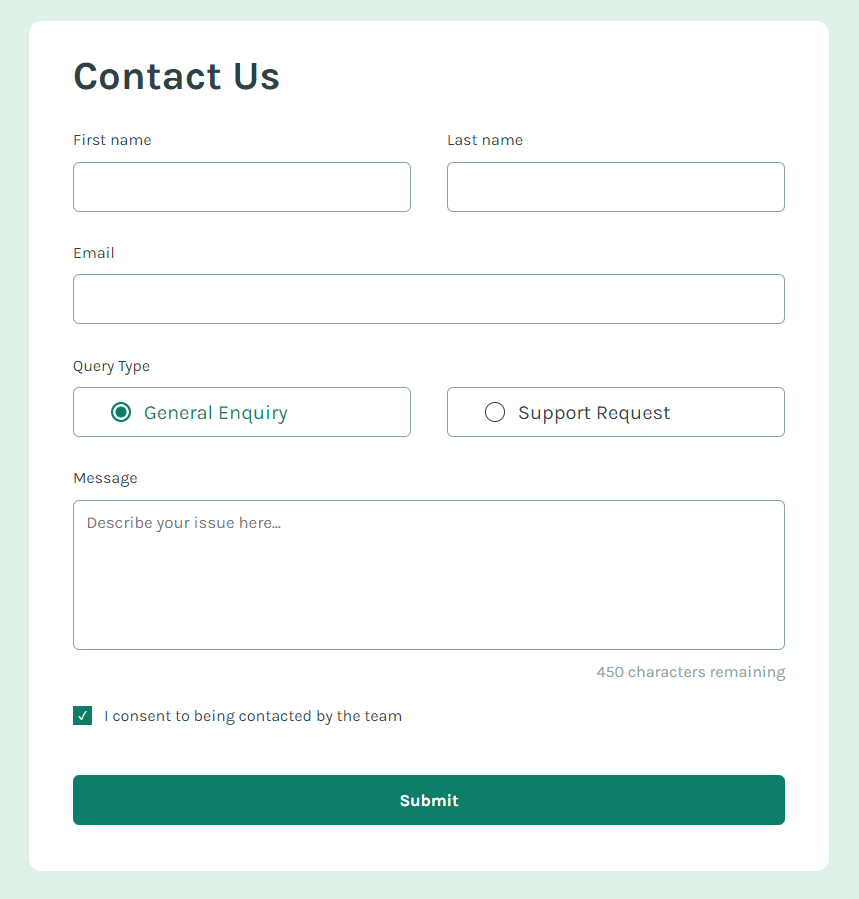

# Frontend Mentor - Contact form solution

This is a solution to the [Contact form challenge on Frontend Mentor](https://www.frontendmentor.io/challenges/contact-form--G-hYlqKJj). Frontend Mentor challenges help you improve your coding skills by building realistic projects. 

## Table of contents

- [Overview](#overview)
  - [The challenge](#the-challenge)
  - [Screenshot](#screenshot)
  - [Links](#links)
- [My process](#my-process)
  - [Built with](#built-with)
  - [What I learned](#what-i-learned)
  - [Continued development](#continued-development)
- [Author](#author)
- [Acknowledgments](#acknowledgments)

**Note: Delete this note and update the table of contents based on what sections you keep.**

## Overview

### The challenge

Users should be able to:

- Complete the form and see a success toast message upon successful submission
- Receive form validation messages if:
  - A required field has been missed
  - The email address is not formatted correctly
- Complete the form only using their keyboard
- Have inputs, error messages, and the success message announced on their screen reader
- View the optimal layout for the interface depending on their device's screen size
- See hover and focus states for all interactive elements on the page

### Screenshot



### Links

- Solution URL: [Frontendmentor](https://www.frontendmentor.io/solutions/simple-contact-form-c2tE7TTJ0q)
- Live Site URL: [Netlify](https://luminous-trifle-37b565.netlify.app)

## My process

### Built with

- Semantic HTML5 markup
- CSS custom properties
- Flexbox
- Desktop-first workflow
- Interactive elements with Javascript


### What I learned

I learned a lot and I took notes of everything. I learned to build a form using semantic tags like form, fieldset, legend and label. I learned to use different input types and tags like textarea and select.

```html
<fieldset class="inputName">
  <!-- A tag fieldset tem valor semântico e agrupa tags relacionadas ao mesmo grupo -->
  <div class="firstName">
    <label for="inputFirstName" class="firstName_label">First name</label>
    <input id="inputFirstName" name="firstName" class="firstName_input border_change" type="text" pattern="[A-Za-z09]{3,20}" required>
  </div>
  <div class="lastName">
    <label for="inputLastName" class="lastName_label">Last name</label>
    <input id="inputLastName" name="lastName" class="lastName_input border_change"  type="text" required>
  </div>
</fieldset>
```

ChatGPT helped me to use Javascript to make some features interactive, like the character counter feature in the textarea. And I also used Javascript to make the query field selectable when the usuer clicks any part of the button, starting with the border.

```javascript
document.addEventListener('DOMContentLoaded', function() {
    const textarea = document.getElementById('messageBox');
    const charCount = document.getElementById('charCount');
    const maxChars = 450;
  
    textarea.addEventListener('input', function() {
      const remaining = maxChars - textarea.value.length;
      charCount.textContent = `${remaining} characters remaining`;
    });
  });
```

I also learned how to use ::before and ::after pseudoelements to help stylize my components.


```css
.consent_chkbox {
    appearance: none;
    width: 15px;
    height: 15px;
    background-color: var(--white);
    border: solid 1px var(--darkgreen);
    position: relative;
    transition: .2s;
}

.consent_chkbox:checked {
    background-color: var(--darkgreen);
}

.consent_chkbox::after {
    content: '';
    position: absolute;
    top: -1.5px;
    left: -0.5px;
    width: 15px;
    height: 15px;
    display: flex;
    align-items: center;
    justify-content: center;
    color: var(--white);
    font-size: .6rem;
    visibility: hidden;
}

.consent_chkbox:checked::after {
    content: '✓';
    visibility: visible;
}
```


### Continued development

I would like to learn more about using Javascript to make my projects more interactive. I would also like to learn how to use pseudoelements to further stylize my css components.


## Author

- Frontend Mentor - [@jullyanvpr](https://www.frontendmentor.io/profile/jullyanvpr)


## Acknowledgments

I'd like to thank Coding2GO for the excellent tutorial on how to use pseudoelements.